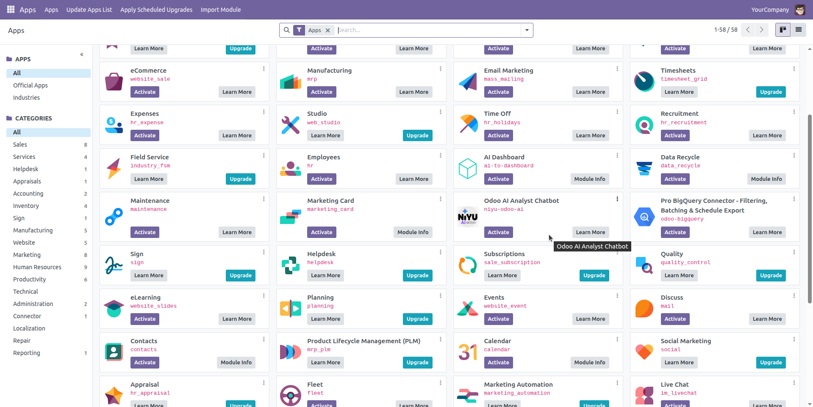
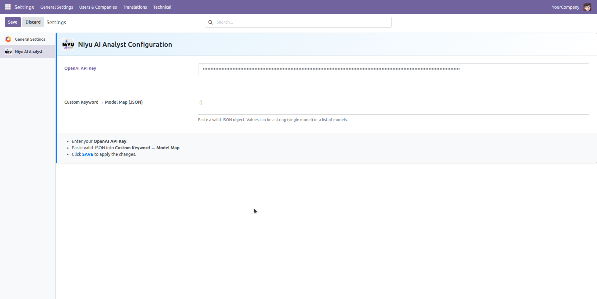
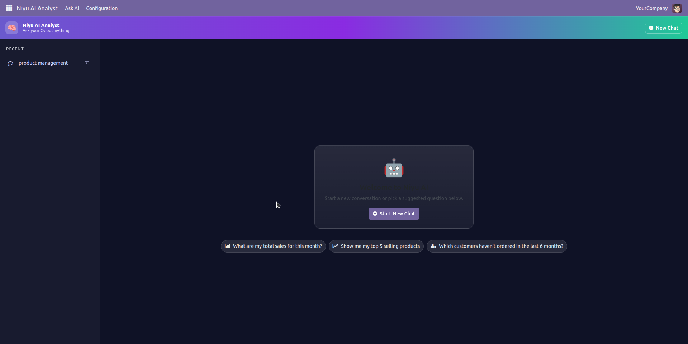

# Installation & Initial Configuration Guide

#### Step 1: Obtain the Module

1. **Purchase from Odoo App Store:** Navigate to the Odoo App Store (apps.odoo.com), search for "Odoo AI Analyst Chatbot" by "Niyulabs."
2. **Download:** After purchasing, download the module's compressed file (e.g., niyulabs\_ai\_analyst.zip). This file contains all the necessary components for the module.

#### Step 2: Upload and Install the Module

There are two primary methods for installing custom Odoo modules:

**Method A: For Odoo.sh or Self-Hosted with File Access**

1. **Extract:** Unzip the downloaded niyulabs\_ai\_analyst.zip file.
2. **Upload to Addons Path:**
   * Connect to your Odoo server (or Odoo.sh project via Git).
   * Place the extracted niyulabs\_ai\_analyst folder into your Odoo instance's addons path. Common paths include /opt/odoo/custom/addons/ or within your Odoo.sh custom modules directory.
   * **Important:** Ensure the folder permissions allow Odoo to read its contents.
3. **Restart Odoo Service:** After placing the module, restart your Odoo service to allow Odoo to detect the new module.
   * sudo service odoo-server restart (for Linux)

**Method B: Through Odoo's Web Interface (Less Common for Large Modules)**

1. **Activate Developer Mode:**
   * Go to **Settings**.
   * Scroll down to the bottom and click "Activate the developer mode" (or "Activate the developer mode (with assets)").
2. **Update App List:**
   * Go to the **Apps** menu.
   * Click on "Update Apps List" (sometimes visible after activating developer mode). Confirm the action. This refreshes Odoo's list of available modules.
3. **Upload Module (if available):**
   * In the Apps menu, locate the "Upload Module" button (this option might not always be available depending on your Odoo version/hosting).
   * Select the downloaded niyulabs\_ai\_analyst.zip file and upload it. Odoo will automatically place it in the correct location and restart the service if needed.

#### Step 3: Activate the Module in Odoo

1. **Navigate to Apps:** Go to the **Apps** menu in your Odoo instance.
2. **Search:** In the search bar, type "AI Analyst" or "Niyulabs."
3. **Locate & Install:** You should see "Odoo AI Analyst Chatbot by Niyulabs." Click the **Install** button next to it.
   * Caption: Locate and install the Niyulabs AI Analyst Chatbot from the Odoo Apps menu.
4. Odoo will now install the module, which may take a few moments as it sets up necessary database tables and configurations.

<figure><figcaption></figcaption></figure>

#### Step 4: Initial Configuration: Connect to Your LLM (OpenAI)

After installation, the most crucial step is to link your Odoo instance to the external Large Language Model.

1. **Access Niyulabs AI Analyst Settings:**
   * Go to **Settings** in your Odoo dashboard.
   * You will find a dedicated section or menu item for "Niyulabs AI Analyst" or simply "AI Analyst" directly visible in the settings.
2. **Enter OpenAI API Key:**
   * Within this dedicated Niyulabs AI Analyst settings page, locate the field specifically for the **OpenAI API Key**.
   * Paste your OpenAI API Key into this field.
3. **Add Custom Keyword Mapping (Optional):**
   * This settings page is also where Niyulabs provides the ability to add **Custom Keyword Mappings**. This advanced feature allows you to define specific terms or phrases that the AI Analyst should understand and link to particular Odoo fields or data entities, enhancing its accuracy for your unique business language.
4. **Save Changes:** Ensure you **Save** the changes made on this settings page.
   * Caption: Configure your OpenAI API key and other settings within the dedicated Niyulabs AI Analyst section in Odoo Settings.

<figure><figcaption></figcaption></figure>

#### Step 5: User Permissions

To control who can access and use the AI Analyst Chatbot, you need to assign the appropriate user groups:

1. **Go to Users:** Navigate to **Settings > Users & Companies > Users**.
2. **Edit User:** Select the user(s) who should have access to the chatbot.
3. **Assign Group:** Under the "Access Rights" tab, look for a new security group created by the Niyulabs module, typically named:
   * Odoo AI Analyst / User
   * Niyulabs AI Analyst User
   * Check this box to grant the user access.
4. **Save:** Save the user's settings.

#### Step 6: First Interaction and Testing

Now that everything is set up, it's time to test your new AI Analyst!

1. **Locate the Chatbot Interface:**
   * Log in as a user with the newly assigned "Odoo AI Analyst User" role.
   * You will find a new menu item, usually labeled "Niyulabs AI Analyst" or "AI Analyst," in your main Odoo navigation bar. Click on it to open the chatbot interface.
   * Caption: The intuitive Niyulabs AI Analyst chatbot interface, ready for your data queries.

<figure><figcaption></figcaption></figure>

1. **Ask Your First Question:**
   * In the chat window, type a simple question related to your Odoo data, for example:
     * "Show me my total sales for last month."
     * "What are the top 3 selling products this quarter?"
     * "How many open opportunities do we have in CRM?"
     * "What is the current stock level for 'Product A'?"
2. **Verify the Response:** The chatbot should process your query and provide a relevant answer based on your Odoo data. If it struggles, try rephrasing or asking a more specific question.

#### Troubleshooting Common Issues

* **Module Not Found after Upload:**
  * Ensure the module folder is directly in an addons path.
  * Restart Odoo service and "Update Apps List" again.
  * Check folder permissions.
* **"Error: OpenAI API Key Invalid" / "Could not connect to OpenAI":**
  * Double-check that your OpenAI API Key is copied correctly without extra spaces in the **Niyulabs AI Analyst settings page**.
  * Ensure your OpenAI account has sufficient credits or a valid payment method.
  * Verify your Odoo server has outbound internet access to api.openai.com.
  * Check OpenAI's status page for any service outages.
* **"No response" / "Generic Error":**
  * Check Odoo server logs for detailed error messages.
  * Verify user permissions.
  * Ensure the selected OpenAI model is valid and available.
* **Incorrect or Irrelevant Data:**
  * Ensure your question is clear and specific.
  * The chatbot's performance depends on the clarity and structure of your Odoo data.
  * Consult Niyulabs' documentation or support for advanced query tuning or data model specific configurations.

Congratulations! Your Odoo AI Analyst Chatbot by Niyulabs is now installed and ready to empower your team with intelligent, conversational data insights. Explore its capabilities and transform how you interact with your Odoo data.
