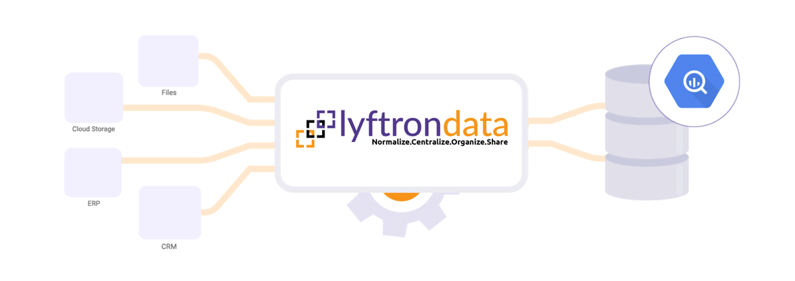
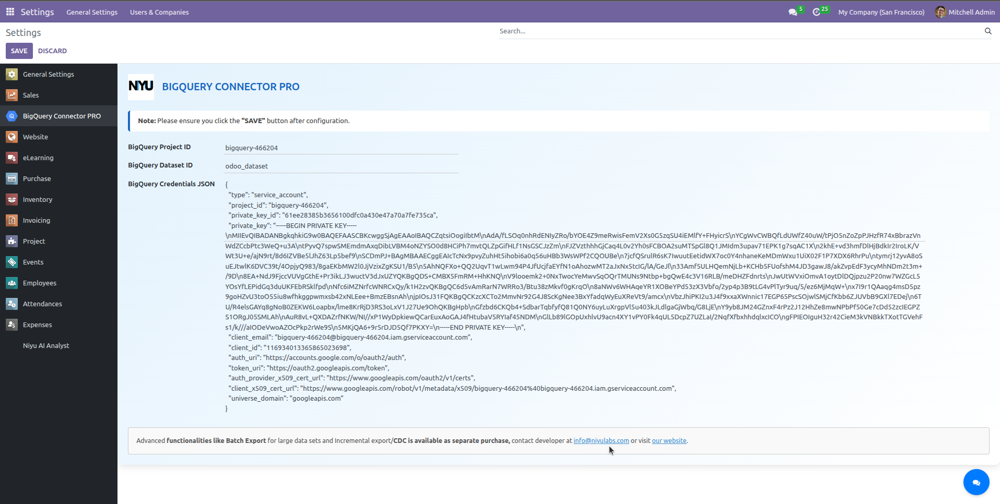
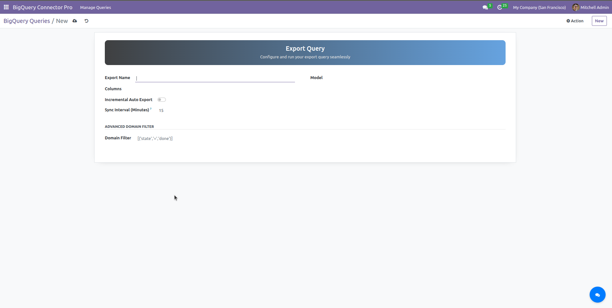
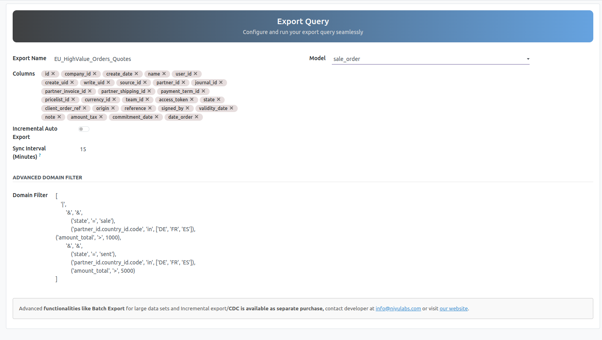
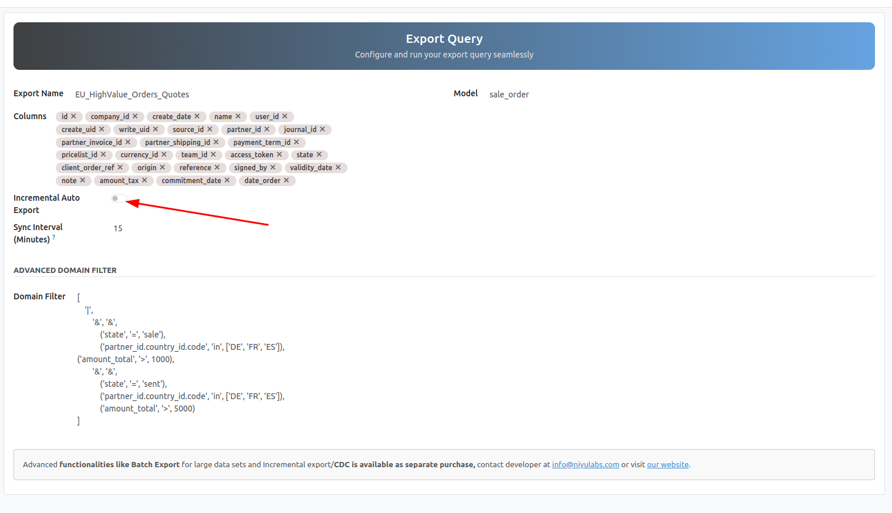

# Installation & Initial Setup

## **How to connect Odoo with Google BigQuery using the Niyu Labs Connector**

The official installation and setup guide for the Niyu Labs Google BigQuery Connector. Unlock your Odoo data's full potential by integrating it with Google's powerful analytics platform.

<figure><figcaption></figcaption></figure>

#### **1. Requirements**

Before starting, please ensure you have the following:

* **Odoo Instance:**
  * **Versions Supported:** 12, 13, 14, 15, 16, 17,18
  * **Edition:** Enterprise or Community
* **Google Cloud Platform Account:** An active account with the **BigQuery API** enabled.
* **Permissions:**
  * **Odoo:** Administrator access to install modules and configure settings.
  * **Google Cloud:** Permissions to create projects, datasets, service accounts, and assign IAM roles.
* **Python Libraries:** This module depends on google-cloud-bigquery, pandas, and pyarrow.
  * **For Odoo.sh:** Add these library names to your repository's requirements.txt file.
  * **For On-Premise Servers:** Install them manually into your Odoo Python environment (pip3 install google-cloud-bigquery pandas pyarrow) and restart your Odoo server.

#### **2. Installation**

1. **Download the Module:**\
   Obtain the Niyu Labs BigQuery Connector from the Odoo Apps Store:\
   [https://apps.odoo.com/apps/modules/18.0/odoo-bigquery](https://apps.odoo.com/apps/modules/18.0/odoo-bigquery)
2. **Update Apps List:**\
   In your Odoo instance, enable Developer Mode, then navigate to **Apps** and click **Update Apps List**.\

3. **Install the Module:**\
   In the Apps menu, search for Niyu Labs Pro BigQuery Connector and click **Install**.\

#### **3. Configuration: Part A - Google Cloud Setup**

First, we need to create the necessary credentials in your Google Cloud account.

**3.1. Get Your Project ID and Dataset ID**

1. Log in to the [Google Cloud Console](https://www.google.com/url?sa=E\&q=https%3A%2F%2Fconsole.cloud.google.com).
2. Navigate to the **BigQuery** section.
3. Select an existing project or **Create a new project**.
   * **Important:** The **Project ID** must be globally unique. Note it down.\
     \[Screenshot of Google Cloud Console showing the Project ID]
4. Within your project, create a new **Dataset**. This is where your Odoo tables will be stored.
   * **Important:** The **Dataset ID** will be used in the Odoo configuration. Note it down.\
     \[Screenshot of the 'Create dataset' dialog in BigQuery]

**3.2. Create a Service Account & Credentials JSON**

A service account allows Odoo to securely authenticate with your Google Cloud project.

1. In the Google Cloud Console, navigate to **IAM & Admin → Service Accounts**.
2. Click **CREATE SERVICE ACCOUNT**. Give it a name (e.g., odoo-connector-niyu-labs).
3. **Grant Permissions:** Assign the following roles to the service account to allow it to manage data and run jobs. For optimal security, use these specific roles:
   * BigQuery Data Editor
   * BigQuery Job User
   * (Alternatively, for simplicity, you can assign the BigQuery Admin role).\
     \[Screenshot showing the assignment of IAM roles]
4. **Generate a JSON Key:**
   * After creating the service account, click on it from the list.
   * Go to the **KEYS** tab.
   * Click **ADD KEY → Create new key**.
   * Choose **JSON** as the key type and click **CREATE**.
   * A JSON file will be downloaded to your computer. **Keep this file secure, as it contains your credentials.**\
     \[Screenshot of the 'Keys' tab with the 'Add Key' button highlighted]

#### **4. Configuration: Part B - Odoo Setup**

Now, let's connect Odoo to BigQuery using the credentials you just created.

1. **Enter Credentials in Odoo:**
   * In Odoo, navigate to **Settings → General Settings** and scroll down to the **Niyu Labs BigQuery Connector** section.
   * Enter the **BigQuery Project ID** and **BigQuery Dataset ID** you noted down earlier.
   * Open the downloaded **JSON key file** in a text editor, copy its entire contents, and paste it into the **BigQuery Credentials JSON** field.
   * Click **SAVE**.

<figure><figcaption></figcaption></figure>

**Test the Connection:**

* Click the **Save** button after adding the credentials.
* A success notification confirms that your credentials are correct and Odoo can communicate with your BigQuery project.\

#### **5. Creating Your First Smart Export**

The Niyu Labs connector uses **Export Configurations** to give you granular control over your data syncs. This is where you define exactly what data to send and how often to send it.

Navigate to **Settings → Technica → Database Structure → BigQuery Export Configurations** and click **Create**.

<figure><figcaption></figcaption></figure>

**Step 1: Basic Setup**

* **Name:** Give your configuration a descriptive name (e.g., "Confirmed Sales Orders").
* **Odoo Model:** Select the Odoo model you want to export (e.g., sale.order).

**Step 2: Column Filtering (Optional)**

* Go to the **Fields to Export** tab.
* Click **Add a line** to choose the specific fields you want in your BigQuery table. If you leave this empty, all fields will be exported.
* **Why?** This is perfect for excluding sensitive data and keeping your BigQuery tables lean and optimized.\
  \[Screenshot of the 'Fields to Export' tab with a few fields selected]

**Step 3: Record Filtering with Domain (Optional)**

* Use the **Domain Filter** field to specify exactly which records to export using Odoo's domain syntax.
* **Example:** To export only confirmed sales orders, use: \[('state', 'in', \['sale', 'done'])]

<figure><figcaption></figcaption></figure>

**Step 4: The 'One-Click' Automated Sync**

This is where the magic happens. No need to manually create complex cron jobs!

* Check the box **Enable Incremental Sync**.
* **Sync Field:** Select a date field to track changes. write\_date is recommended to capture both new and updated records.
* **Sync Frequency:** Choose how often you want the sync to run (e.g., Hourly, Daily, Weekly). The connector automatically creates and manages the scheduled action for you. **And boom, your automation is live!**

<figure><figcaption></figcaption></figure>

#### **6. Execution and Verification**

1. **Run the First Export:**
   * After saving your configuration, click the **Run Export Now** button to perform the initial full data transfer.\
     \[Screenshot of the 'Run Export Now' button on the configuration form]
2. **Check BigQuery:**
   * Log back into your [Google Cloud Console](https://www.google.com/url?sa=E\&q=https%3A%2F%2Fconsole.cloud.google.com) and go to your BigQuery dataset.
   * Refresh the explorer panel. You will see a new table named after your Odoo model (e.g., sale\_order).
   * Click on the table and use the **Preview** tab to confirm that your data has arrived correctly, respecting your column and domain filters.\
     \[Screenshot of BigQuery showing the newly created table and its data preview]

**Congratulations!** Your smart export is now configured. The Niyu Labs connector will now automatically keep your BigQuery dataset up-to-date based on the schedule you defined, syncing only the changes efficiently and cost-effectively.
